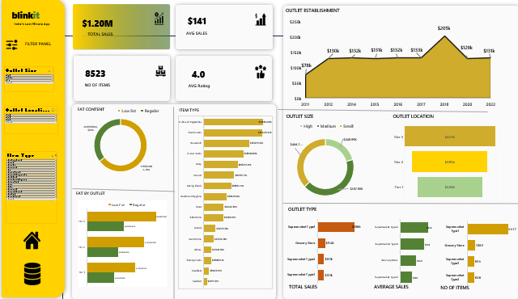

# 🟢 Blinkit Sales Performance Dashboard

## 📖 Project Overview  
The **Blinkit Sales Performance Dashboard** is a fully interactive Excel dashboard designed to visualize and analyze Blinkit’s key business performance indicators (KPIs).  
It converts raw sales data into **clean, dynamic visuals** — highlighting performance by city, outlet type, and product category.

This project demonstrates how **data storytelling** and **Excel analytics** can simplify decision-making for business growth.

---

## 🎯 Objectives  
- Analyze Blinkit’s sales performance across cities and outlet types.  
- Identify top-performing product categories and their contributions to revenue.  
- Measure outlet performance using KPIs like **Total Sales**, **Average Rating**, and **Item Count**.  
- Build a professional, interactive dashboard layout using Excel visuals and slicers.

---

## 📊 Key Insights  
✅ **Top Cities:** Tier-1 cities show the highest revenue and order volume.  
✅ **Outlet Type Analysis:** Supermarket outlets lead in total sales and customer satisfaction.  
✅ **Product Category Insights:** Bakery, Dairy, and Beverages are the highest contributors.  
✅ **Performance Trends:** Steady growth pattern with slight Q2 and Q4 peaks.  
✅ **Overall Rating:** Consistent performance across outlets, indicating brand trust.  

---

## ⚙️ Excel Features Used  

| Feature | Purpose |
|----------|----------|
| **Power Query** | Data cleaning and transformation |
| **Pivot Tables** | Summary metrics for KPIs |
| **Slicers** | Filter data by city, category, outlet type |
| **Charts (Column, Donut, Line)** | Visualize key performance trends |
| **Conditional Formatting** | Highlight top and low performers |
| **Custom Layout Design** | Professional dashboard formatting |

---

## 🧠 Skills Demonstrated  
- Business KPI Analysis  
- Data Cleaning and Transformation  
- Dashboard Design (UI/UX)  
- Visualization & Storytelling  
- Excel Automation with Power Query  

---

## 📸 Dashboard Preview (Visible Below 👇)

  

---

## 📂 File Details  
- **File name:** `Blinkit Dashboard.xlsx`  
- **Sheets included:**  
  - `BlinkIT Raw Data` → Original dataset  
  - `Sheet Design` → Dashboard layout template  
  - `Dash_Board` → Final interactive dashboard  

---

## 🧾 How to Use  
1. Download `Blinkit Dashboard.xlsx`.  
2. Open in **Microsoft Excel (2016 or later)**.  
3. Click **Enable Content** if prompted.  
4. Use slicers to explore performance by city, outlet type, and product category.

---

## 👩‍💻 Author  
**Akshatha Reddy**  
📍 Data Analytics Enthusiast | Excel | Power BI | SQL | Python (Beginner)  
🌐 [GitHub](https://github.com/Akshatha35)  
💼 [LinkedIn](https://linkedin.com/in/YourLinkedInProfile)

---

⭐ *If you like this dashboard, please give it a star on GitHub!* ⭐
